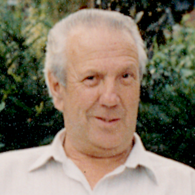

# Bill Everitt: memoirs

<figure style="max-width: 72%; margin: 1em auto; font-size: .9em; text-align: center;">
  
  <figcaption>Born: William Arthur Everitt, Leicester 1925, died: Oadby 2008</figcaption>
</figure>

<!--
- [Introduction](./introduction.html)
- [1. Early Years](./1-early-years/1.1-very-early-years.html)
- [2. Before School](./2-before-school/2.1-the-portwey.html)
- [3. Schooldays](./3-schooldays/3.1-starting-school.html)
- [4. 1938](./4-1938/4.1-war-and-politics.html)
-->

- [Introduction](./introduction.html)
- 1. Early Years
  - [1.1-Very Early Years](./1-early-years/1.1-very-early-years.html)
  - [1.2-Great Aunt Bessie and Grandparents](./1-early-years/1.2-aunt-bessie-grandparents/.html)
  - [1.3-Birth and Welfare](./1-early-years/1.3-birth-and-welfare/.html)
  - [1.4-The Portwey and an Accident](./1-early-years/1.4-the-portwey-and-an-accident.html)
  - [1.5-Events Recounted by my Mother or Father](./1-early-years/1.5-events-recounted-by-parents.html)
  - [1.6-Aunt Em](./1-early-years/1.6-aunt-em.html)
- 2. Before School
  - [2.1 The Portwey](./2-before-school/2.1-the-portwey.html)
  - [2.2 Inside The House](./2-before-school/2.2-inside-the-house.html)
  - [2.3 A Serious Injury](./2-before-school/2.3-a-serious-injury.html)
  - [2.4 Parents Life](./2-before-school/2.4-parents-life.html)
  - [2.5 Horse Cart Deliveries](./2-before-school/2.5-horse-cart-deliveries.html)
  - [2.6 Humberstone Pubs](./2-before-school/2.6-humberstone-pubs.html)
  - [2.7 Road Building](./2-before-school/2.7-road-building.html)
  - [2.8 Friends Before School](./2-before-school/2.8-friends-before-school.html)
- 3. Schooldays
  - [3.1 Schooldays, the Beginning](./3-schooldays/3.1-starting-school.html)
  - [3.2 School Routine and Discipline](./3-schooldays/3.2-routine-and-discipline.html)
  - [3.3 Going to School Alone](./3-schooldays/3.3-going-to-school-alone.html)
  - [3.4 Social Life and Community](./3-schooldays/3.4-social-life-community.html)
  - [3.5 Play and Life around The Portwey](./3-schooldays/3.5-play-entertainment.html)
  - [3.6 The School System at St. Barnabas](./3-schooldays/3.6-school-system.html)
  - [3.7 Scholarship and Grammar School](./3-schooldays/3.7-scholarship-grammar-school.html)
- 4. 1938
  - [4.1 War and Politics](./4-1938/4.1-war-and-politics.html)

This collection of [my father’s writing](https://daveeveritt.github.io/bill-everitt-memoirs/) is the first part of my his life story, about his childhood in Leicester, which I encouraged him to write down. They run up to 1938. He didn’t like talking about the war or what he did then. However, we now know that part of his work was to inspect crashed aircraft to determine the cause.

The text is from files on his computer and in his papers found after his death, in an old format from which the text had to be extracted and repaired. Some of the text appears to have been scanned from printed (perhaps originally typewritten?) pages by OCR (Optical Character Recognition) which sometimes misreads words, while other partially-duplicated text appeared to be corrections, so it was necessary to work out the meaning in places and make edits for readability.

The very first file was titled “Chapter 1” and, although subsequent chapters are not labelled, there are four main headings:

After which, there are no further files. There is more written text, but it overlaps existing memoirs and will require more work to integrate.

The [tribute](tribute.md) read out at his funeral gives a general background, with some details from friends and family.

## Leicester in the Early 20th Century

from [A History Of Leicester](https://localhistories.org/a-history-of-leicester/)

"Leicester was described in a magazine in 1909: it is difficult to think of Leicester as a town of considerable industrial importance. The impression remains with one of a clear and sunny atmosphere with wide streets, clean brick buildings, and a constant background of green trees. The boot and hosiery factories appear to give out little or no smoke. Leicester continued to grow rapidly during the 20th century. It was made a city in 1919."

---

## TO DO

- [ ] Add link to index in all subsections
- [ ] list family members mentioned and add images
- [ ] make compact family tree of people mentioned?
- [ ] add [Martin Rattler](https://www.google.co.uk/books/edition/Martin_Rattler/vmkCAAAAYAAJ?hl=en&gbpv=1&pg=PA10&printsec=frontcover) and other books of Grandad’s
- [ ] check through new material

## Images (use family history files?)

- [ ] 24 The Portwey: scan numbers, house photo
- [ ] Aunt Em
- [ ] young Arthur Everitt (Bill’s father)
- [ ] uncle Alf
- [ ] uncle George
- [ ] Great Aunt Bessie

<!--
"Sickly children, wayward girls and maiden aunts"

- https://www.nationalarchives.gov.uk/search/results?_q=leicester
- https://www.storyofleicester.info
- leicester historic images https://www.pinterest.co.uk/pin/68820700545273570/
- Pin, old Leicester: https://www.pinterest.co.uk/pin/25192079155347292/
- Pin, old Leicester: https://www.pinterest.co.uk/jewelsfem/leicester-pre-1950/
- Plough and windmill (WAE-10) https://pubhistoryproject.co.uk/2021/02/12/windmill-inn-old-plough-humberstone-village/
-->
